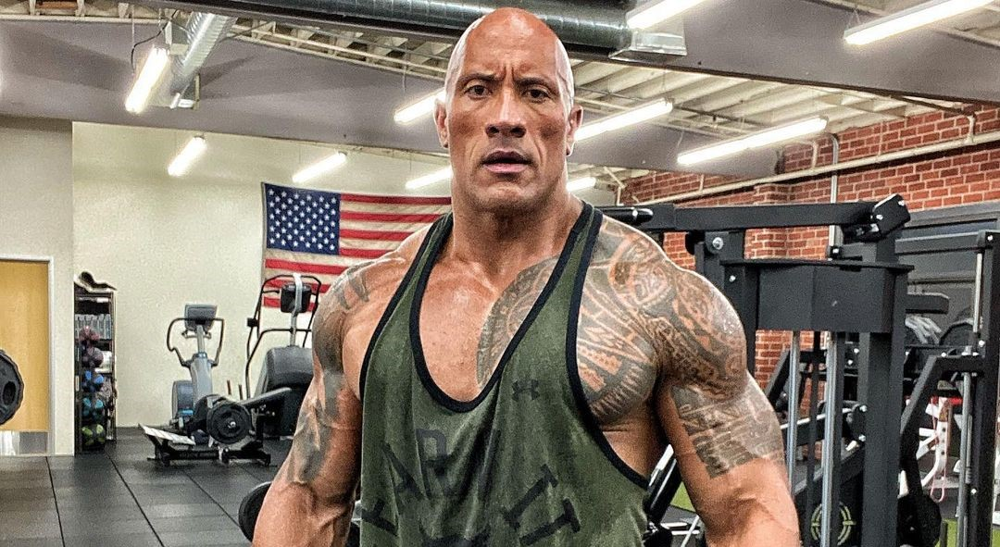
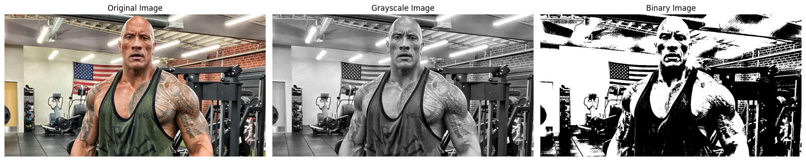

# Image Processing Pipeline: Color to Grayscale to Binary Conversion



[](https://colab.research.google.com/drive/1_PhZgaRBGWn3Sp-s_4PP8KP5NSdGpU42?usp=sharing)

A comprehensive computer vision project demonstrating fundamental image processing techniques using OpenCV and Python. This project showcases the complete pipeline from color image input to grayscale conversion and binary thresholding, providing a solid foundation for understanding digital image processing concepts.

## 🚀 Project Overview

This project implements a three-stage image processing pipeline:

1. **Stage 1**: Load and display original color images
2. **Stage 2**: Convert color images to grayscale using OpenCV
3. **Stage 3**: Apply binary thresholding to create black and white images

The project demonstrates essential computer vision preprocessing techniques that are fundamental to many machine learning and image analysis applications.

## 🎯 Key Features

- **Interactive Image Upload**: Easy file upload interface for Google Colab
- **Multi-format Support**: Works with various image formats (JPG, PNG, etc.)
- **Grayscale Conversion**: Efficient color to grayscale transformation
- **Binary Thresholding**: Fixed threshold binarization for edge detection and segmentation
- **Visual Comparison**: Side-by-side display of original, grayscale, and binary images
- **Matplotlib Integration**: Professional visualization with customizable plots

## 🛠️ Technologies Used

- **OpenCV (cv2)**: Computer vision and image processing library
- **NumPy**: Numerical computing and array operations
- **Matplotlib**: Data visualization and image plotting
- **Python**: Programming language
- **Google Colab**: Interactive development environment with file upload capabilities

## 🚀 Getting Started

### Prerequisites

- Python 3.7+
- OpenCV (opencv-python-headless)
- NumPy
- Matplotlib
- Jupyter Notebook or Google Colab

### Recommended: Google Colab

For optimal performance and ease of use, we **strongly recommend** using Google Colab:

[](https://colab.research.google.com/)

**Why Google Colab?**
- **Pre-installed libraries** (OpenCV, NumPy, Matplotlib)
- **Interactive file upload** widget
- No local setup required
- **Free access** to computing resources
- **Easy sharing** and collaboration

### Usage Options

#### Option 1: Google Colab (Recommended)
1. Open the notebook in Google Colab
2. Run the setup cell to install dependencies
3. Upload your image using the file upload widget
4. Execute the processing pipeline
5. View the results with side-by-side comparison

#### Option 2: Local Usage
1. Clone this repository:
```bash
git clone <repository-url>
cd image-processing-pipeline
```

2. Install dependencies:
```bash
pip install opencv-python-headless matplotlib numpy jupyter
```

3. Run the notebook:
```bash
jupyter notebook processing_pipeline.ipynb
```

#### Option 3: Python Script Usage
```python
import cv2
import numpy as np
import matplotlib.pyplot as plt

# Load image
image = cv2.imread('your_image.jpg')

# Convert to grayscale
gray = cv2.cvtColor(image, cv2.COLOR_BGR2GRAY)

# Apply binary threshold
_, binary = cv2.threshold(gray, 127, 255, cv2.THRESH_BINARY)

# Display results
fig, axes = plt.subplots(1, 3, figsize=(18, 6))
axes[0].imshow(cv2.cvtColor(image, cv2.COLOR_BGR2RGB))
axes[1].imshow(gray, cmap='gray')
axes[2].imshow(binary, cmap='gray')
plt.show()
```

## 📊 Sample Images

The project includes sample images in the `images/` directory for testing and demonstration purposes.

### Processing Examples

| Original | Grayscale | Binary |
|----------|-----------|--------|
|  | Converted to grayscale | Thresholded at value 127 |

### Final Result

Below is the complete processing pipeline result showing the original image, grayscale conversion, and binary thresholding side by side:



*The result demonstrates the three-stage transformation: color → grayscale → binary image using OpenCV processing techniques.*

## 🔬 Image Processing Techniques Explained

### Color to Grayscale Conversion

The project uses OpenCV's `cv2.cvtColor()` function to convert color images to grayscale:
```python
gray_image = cv2.cvtColor(original_image, cv2.COLOR_BGR2GRAY)
```

This function automatically applies the standard luminance formula that accounts for human eye sensitivity to different colors.

### Binary Thresholding

Binarization is performed using a fixed threshold value of 127:
```python
THRESHOLD_VALUE = 127
_, binary_image = cv2.threshold(gray_image, THRESHOLD_VALUE, 255, cv2.THRESH_BINARY)
```

**How it works:**
- Pixels with value > 127: become white (255)
- Pixels with value ≤ 127: become black (0)
- Result: pure black and white image

### Visualization

The project displays all three images side by side using matplotlib:
- Original image (color)
- Grayscale image
- Binary image

## 📈 Pipeline Architecture

```
Color Image (RGB/BGR)
        ↓
   Grayscale Conversion
        ↓
   Binary Thresholding
        ↓
   Binary Image (0/255)
```

### Processing Parameters

- **Input Format**: RGB/BGR color images
- **Grayscale Method**: OpenCV COLOR_BGR2GRAY conversion
- **Threshold Value**: 127 (middle value, configurable)
- **Threshold Type**: THRESH_BINARY (standard binary thresholding)
- **Output Format**: 8-bit binary image (0 or 255)

## 🎨 Visualization Features

- **Side-by-side Comparison**: Original, grayscale, and binary images
- **Customizable Figure Size**: 18x6 inches for clear visualization
- **Professional Styling**: Clean axes and titles
- **Matplotlib Integration**: Easy saving and export options

## 🔧 Customization Options

### Adjustable Parameters

```python
# Threshold value (0-255)
THRESHOLD_VALUE = 127  # Adjust for different results

# Threshold types
cv2.THRESH_BINARY      # Standard binary
cv2.THRESH_BINARY_INV  # Inverted binary
cv2.THRESH_ADAPTIVE_MEAN_C  # Adaptive thresholding
```

### Advanced Techniques

- **Adaptive Thresholding**: For varying lighting conditions
- **Otsu's Method**: Automatic threshold selection
- **Gaussian Blur**: Noise reduction before thresholding
- **Morphological Operations**: Post-processing cleanup

## 📚 Educational Value

This project serves as an excellent introduction to:

- **Computer Vision Fundamentals**
- **OpenCV Library Usage**
- **Image Data Structures**
- **Preprocessing Techniques**
- **Visualization Best Practices**

## 🤝 Contributing

Contributions are welcome! Please feel free to submit a Pull Request. For major changes, please open an issue first to discuss what you would like to change.

## 📄 License

This project is licensed under the MIT License - see the [LICENSE](LICENSE) file for details.

## 🙏 Acknowledgments

- OpenCV community for excellent documentation
- Google Colab for providing free computing resources
- DIO (Digital Innovation One) for the educational framework